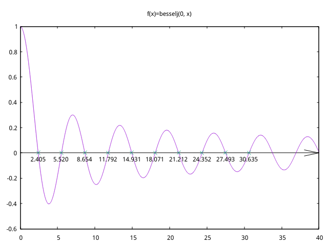

# Chap2 非线性方程求根 实验报告
# 李晨昊 2017011466

## 运行代码方法

环境要求：rust，gnuplot

运行代码
```bash
cargo run
```

## q2.2 
### 任务
实现阻尼牛顿法，利用其求解两个方程

### 解题思路
按照课本上描述的算法的思路编写代码即可，编写时无需显式地维护i和k；也无需使用x数组，因为只需要最近的两个x

我选择了初始的$\lambda_0=0.95$，在$abs(f(x))<1e-10$时退出

除了阻尼牛顿法之外，我还实现了普通的牛顿法，以比较二者的收敛速度

### 实验结果
输出如下
```text
# newton method
iter0: x=17.900000000000034
iter1: x=11.946802328608793
iter2: x=7.985520351936227
iter3: x=5.3569093147954705
iter4: x=3.624996032946104
iter5: x=2.5055891901066367
iter6: x=1.820129422319472
iter7: x=1.4610441098876834
iter8: x=1.339323224262526
iter9: x=1.324912867718656
iter10: x=1.3247179926378148
iter11: x=1.3247179572447472

# damped newton method
iter0: lambda=0.01484375, x=1.113593750000001
iter1: lambda=0.95, x=1.3829182207538546
iter2: lambda=0.95, x=1.3276427364127026
iter3: lambda=0.95, x=1.3247258973156648
iter4: lambda=0.95, x=1.324717957303496
iter5: lambda=0.95, x=1.324717957244746

# newton method
iter0: x=-5.082352941176465
iter1: x=-3.621935916746508
iter2: x=-2.766043783821688
iter3: x=-2.3576006646090777
iter4: x=-2.2448622370251226
iter5: x=-2.2361193863540954
iter6: x=-2.236067979272586
iter7: x=-2.23606797749979

# damped newton method
iter0: lambda=0.2375, x=-1.7841176470588207
iter1: lambda=0.95, x=-2.4966796554393755
iter2: lambda=0.95, x=-2.2719076347071763
iter3: lambda=0.95, x=-2.2368985818378677
iter4: lambda=0.95, x=-2.2360684399003965
iter5: lambda=0.95, x=-2.2360679774999332
```
二者比较发现，阻尼牛顿法的确可以达到比普通的牛顿法更快的收敛速度，主要原因是前几步迭代时可以通过阻尼因子的调节避免"走过头"，这符合课本上的说法：阻尼牛顿法解决了牛顿法当初始值$x_0$偏离准确解$x^*$较远时可能发散的问题。

### 心得体会
经过实验，我认为阻尼牛顿法实现简单，效果较好，是一种很适合平时使用的方程求解方法。

## q1.3 
### 任务
利用fzerotx求解方法来求解$J_0(x)=besselj(0,x)$的前十个正零点，并作图

### 解题思路
首先需要将课本上的matlab代码翻译为rust代码...

$besselj$函数由一个rust函数库提供了，因此不需要再重复实现一次

绘制出$J_0(x)$函数的图像可以发现前十个正零点都$<50$，且任何两个零点之间的距离都$>1$，因此为了确定求根的范围，可以逐一检查$signum(J_0(x))$是否等于$signum(J_0(x+1))$，二者不等时即证明$(x,x+1)$上有唯一零点

选择精度$\epsilon=1e-15$

### 实验结果
输出为
```text
# roots
2.404825557695773, 5.520078110286311, 8.65372791291101, 
11.79153443901429, 14.930917708487785, 18.071063967910924, 
21.211636629879276, 24.352471530749302, 27.49347913204025, 
30.634606468431972
# values at roots
-0.00000000000000009586882554916807, -0.00000000000000001767335334625920, 
0.00000000000000039428723571546593, 0.000000000000002212475072100211, 
0.000000000000000031521707773446503, 0.00000000000000002018692387036633, 
-0.0000000000000028432841916769668, -0.00000000000000028692898951593197, 
0.000000000000000917693595287399, -0.0000000000000005581595433928796
```

图形为



### 心得体会
经过实验，我认为fzerotx求解方法效果较好，且不要求求函数的导数值，虽然实现比较复杂，但是是一种很适合写成库函数的方程求解方法。